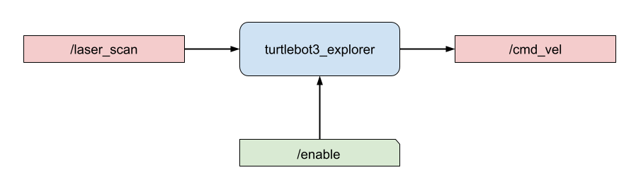
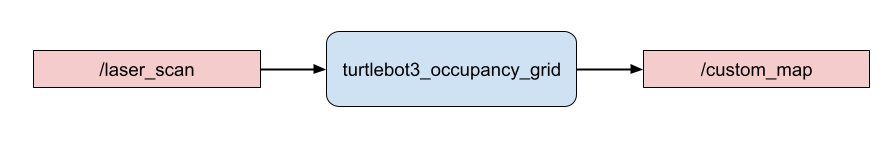
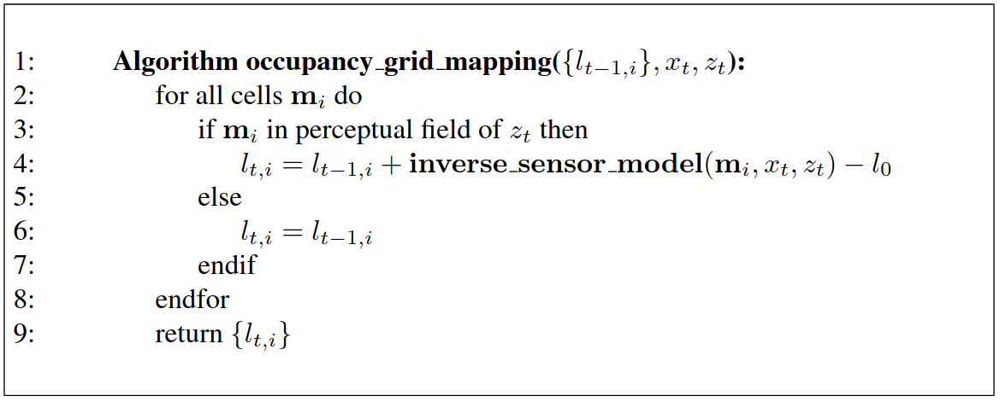
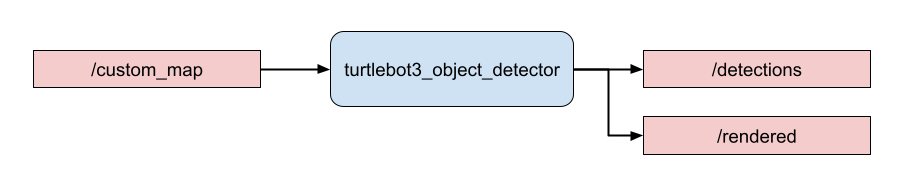
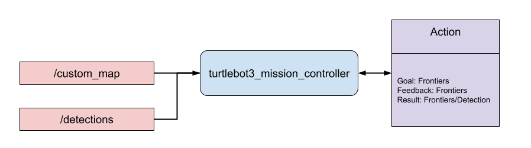
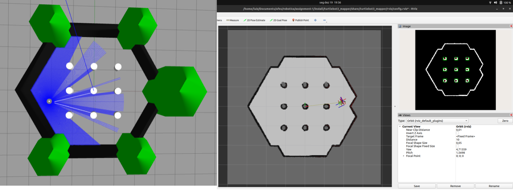
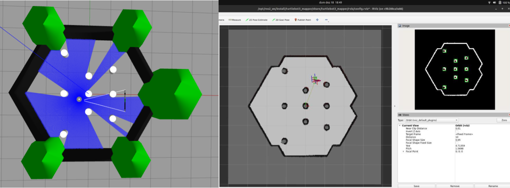
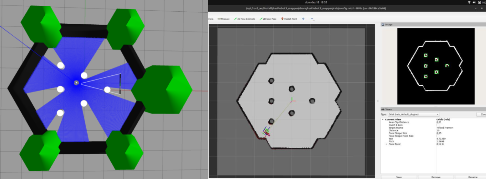
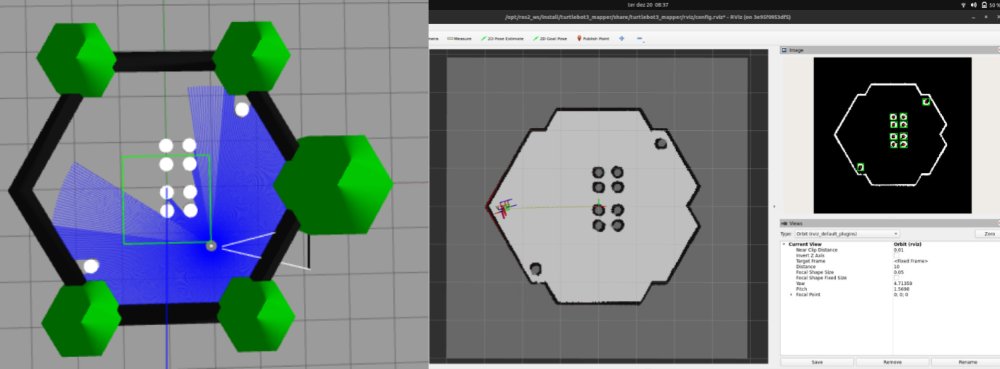

# Assignment 1

The goal in this assignment is to explore concepts of perception in a robotic system to accomplish a task. Given a mobile robot with a set of sensors in a partially known environment, objects/obstacles must be detected and counted. In addition, the robot must be started in a random position and not rely on any teleoperated commands.

## Tools 

     

## Methodology

The task to be solved here has been divided into several other tasks that together are the complete assignment resolution.

### Random start

To be able to initialize the robot in a random position, the [`worlds_gazebo`](https://github.com/autonomous-robots/worlds_gazebo) repository was built. When launching, one of the worlds will be randomly chosen as well as the position of the robot. The [python-sdformat](https://pypi.org/project/python-sdformat/0.1.0/) library is used to read the [SDFormat XML](http://sdformat.org/) file. Thus, the position of the cylinders is collected and a check is made to ensure that the robot never starts in a place already occupied by an obstacle.

### Environment exploration

Exploration is done using just a simple controller `turtlebot3_explorer` based on the [`turtlebot3_examples`](https://github.com/ROBOTIS-GIT/turtlebot3/tree/humble-devel) package. This ROS2 node subscribes to receive messages from the laser sensor and publishes velocity commands. If any obstacle is detected in front of the robot, it then rotates until it finds a free path again. Also has a service that allows to enable or disable this behavior.

<p align="center">
    
</p>

### Occupancy grid

The entire solution proposed here for counting obstacles is based on the use of an occupancy grid map. To generate this map, it was developed a ROS2 node `turtlebot3_occupancy_grid` that subscribes to receive messages from the laser sensor and updates the occupancy grid map for each message received. Initially, all points on the occupancy map have probability equal to 50%. As messages are received from the laser sensor, occupied points will have probability above 50% and free points on the map will have probability below 50%. This probabilistic occupancy grid is published at a fixed rate in the `/custom_map` topic. 


<p align="center">
    
</p>


The occupancy grid mapping algorithm uses the log-odds representation of occupancy:

$$l_{t,i} = log(\frac{p(m_i|z_{1:t},x_{1:t})}{1 - p(m_i|z_{1:t},x_{1:t})})$$

where, 

- $m_i :$ grid cell $i$ 

- $z_{i:t} :$ Collection of measurements up to time $t$

- $x_{i:t} :$ Collection of robot's pose up to time $t$

Using this representation we can avoid numerical instabilities for probabilities near zero or one and compute the problem with less cost. The probabilities are easily recovered from the log-odds ratio:

$$p(m_i|z_{1:t},x_{1:t}) = 1 - \frac{1}{1+ exp(l_{t,i})}$$

The algorithm occupancy grid mapping below loops through all grid cells $i$, and updates those that were measured. The function `inverse_sensor_model` implements the inverse measurement model $p(m_i|z_{1:t},x_{1:t})$ in its log-odds form: if it measured any smaller than the maximum laser range, then mark the points on the map that are under the laser beam as free and the last one as occupied; if it measured some infinite value, truncated to max laser range and marks all as free grid cells. To accomplish this, an implementation of the [Bresenham line drawing algorithm](https://en.wikipedia.org/wiki/Bresenham%27s_line_algorithm) is used.

<p align="center">
    
</p>

### Detect obstacles/objects

Detection obstacles/objects is done using the occupancy grid map by the node `turtlebot3_object_detector`, it subscribes to receive messages from the topic `/custom_map`. For each message received, the map is segmented with a threshold ensuring that only points with a probability greater than this threshold are 1. Then, [OpenCV's connected components](https://docs.opencv.org/3.4/d3/dc0/group__imgproc__shape.html#ga107a78bf7cd25dec05fb4dfc5c9e765f) approach is used these determine occupied regions. Next, you can see how the result of a components connected algorithm in a binary image looks like.

<p align="center">
    
</p>

If this region's area is between a minimum and maximum value, then it publish the [BoundingBox2DArray](http://docs.ros.org/en/api/vision_msgs/html/msg/BoundingBox2DArray.html) and an [Image](http://docs.ros.org/en/noetic/api/sensor_msgs/html/msg/Image.html) with everything rendered to visualize the results.

<p align="center">
    
</p>

### Exploration end

To determine when the exploration should stop, it is used the concept of fronteirs (intersection between unknown regions and free regions) in the occupancy grid map. So, the node `turtlebot3_mission_controller` subscribes to receive messages from topics `/custom_map` and `/detections`. It also makes available an action server, where through the goal sent to the action server, where a user can specify the number of remaining fronteir points, it will enable the `turtlebot3_explorer` to explore the enviromment until it reaches the specified numbers of frontiers points in the occupancy grid. Then, it returns the number of remaining fronteir points and the bounding boxes from `turtlebot3_object_detector`. 

<p align="center">
    
</p>

It is also available an action client node `turtlebot3_mission_client` responsible for sending the exploration task to the action server in `turtlebot3_mission_controller` and saving the results to a file.

## Results

Several worlds were made to test our solution. For the first tested world, we get the following results.

<p align="center">
    
</p>

$$ result = \begin{Bmatrix} x & y & w & h \\\ -1.09 & -1.12 & 0.36 & 0.33 \\\ -0.01 & -1.12 & 0.33& 0.33 \\\ 1.1 & -1.12 & 0.33 & 0.33 \\\ -1.09 & -0.01 & 0.36 & 0.3 \\\ -0.01 & -0.01 & 0.33 & 0.33 \\\ 1.1 & -0.01 & 0.33 & 0.3 \\\ -1.12& 1.07 & 0.33 & 0.3 \\\ -0.01 & 1.07 & 0.33 & 0.3 \\\ 1.1 & 1.07 & 0.33 & 0.3 \end{Bmatrix}$$

Then, for the second tested world,

<p align="center">
    
</p>

$$ result = \begin{Bmatrix} x & y & w & h \\\ -1.09 & -1.81 & 0.33 & 0.33 \\\ 1.1 & -1.12 & 0.33 & 0.33 \\\ -0.01 & -0.82 & 0.33 & 0.33 \\\ -1.09 & -0.01 & 0.3 & 0.33 \\\ -0.01 & -0.01 & 0.33 & 0.33 \\\ 1.07 & -0.01 & 0.33 & 0.33 \\\ -0.01 & 0.8 & 0.3 & 0.33 \\\ 1.07 & 1.1 & 0.33 & 0.3 \\\ -1.09 & 1.79 & 0.33 & 0.33\end{Bmatrix}$$

Then, for the third tested world,

<p align="center">
    
</p>

$$ result = \begin{Bmatrix} x & y & w & h \\\ -1.12 & -1.12 & 0.33 & 0.33 \\\ -0.01 & -0.67 & 0.36 & 0.33 \\\ -1.12 & -0.01 & 0.33 & 0.33 \\\ 1.07 & 0.02 & 0.33 & 0.3 \\\ -0.01 & 0.65 & 0.33 & 0.36 \\\ -1.12 & 1.07 & 0.33 & 0.33\end{Bmatrix}$$

Finally, the last tested world,

<p align="center">
    
</p>

$$ result = \begin{Bmatrix} x & y & w & h \\\ -1.66 & -1.66 & 0.3 & 0.36 \\\ 0.02 & -0.52 & 0.36 & 0.33 \\\ 0.5 &-0.49 & 0.36 & 0.36 \\\ -0.01 & -0.13 & 0.36 & 0.33 \\\ 0.5 & -0.1 & 0.36 & 0.33 \\\ -0.01 & 0.5 & 0.33 & 0.3 \\\ 0.5 & 0.5 & 0.36 & 0.33 \\\ -0.01 & 0.89 & 0.3 & 0.3 \\\ 0.47 & 0.89 & 0.33 & 0.33 \\\ 1.61 & 1.64 & 0.33 & 0.33\end{Bmatrix}$$

The ROS2 nodes proposed here solved the problem with interesting results, as long as the obstacles are not connected or too close to the walls. Furthermore, it is not limited to resolving only in the `turtlebot3_world` world, any close enviromment should work fine.

## Building
You can build all packages needed to run this assignment with docker:
```bash
docker build -t assignment-1:latest -f etc/docker/Dockerfile .
```

## Runnning
Not really safe, but it works.
```bash
sudo xhost +local:root
```

Then, create a network to run all containers in it:
```bash
docker network create my-net
```

Then, open a terminal in the container with support for the QT application:
```bash
docker run -it -e DISPLAY=$DISPLAY -v /tmp/.X11-unix:/tmp/.X11-unix:rw --device /dev/dri/ --net=my-net assignment-1:latest /bin/bash
```

The first thing you'll need to do is run the gazebo inside the container:
```bash
gazebo
```

We haven't figured out why yet, but the first launch of the gazebo inside the container takes a long time. After the gazebo has opened the first time, you can close it and run our launch.
```bash
ros2 launch turtlebot3_mapper turtlebot3_mapper_launch.py
```

If you want to explore the environment, just open a new container in the same network and run the action client node.
```bash
docker run -it --net=my-net assignment-1:latest /bin/bash
ros2 run turtlebot3_mapper turtlebot3_mission_client -f 200
```

After the task is finished, you can view the results in the generated `results.txt` file.

## Other sources of information

- THRUN, Sebastian; BURGARD, Wolfren; FOX, Dieter. Probabilistic Robotics. MIT Press, 2005. p. 221-243.

- SAKAI, Atsushi. Python Robotics, Python sample codes for robotics algorithms. <https://github.com/AtsushiSakai/PythonRobotics>

- ROBOTIS. ROS packages for Turtlebot3. <https://github.com/ROBOTIS-GIT/turtlebot3>.

- ROBOTIS. Simulations for Turtlebot3. <https://github.com/ROBOTIS-GIT/turtlebot3_simulations>.

- ROS PLANNING. ROS2 Navigation Framework and System. <https://github.com/ros-planning/navigation2>